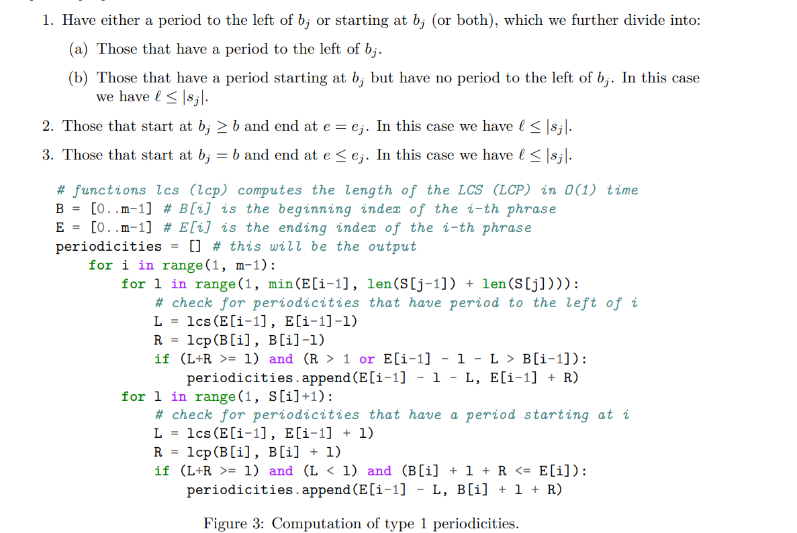

# Bioinformatics Algorithms Notes

My notes from the book [1] that I have written **purely from memory**. I tried to accompany each section with a Python (pseudo)code of the relevant algorithms to see how well understood them.

A screenshot:

## References:

[1] Enno Ohlebusch, Bioinformatics Algorithms: Sequence Analysis, Genome Rearrangements, and Phylogenetic Reconstruction. Oldenbusch Verlag, 2013.
